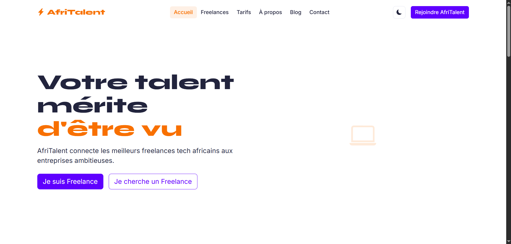

# DIALLO-Abdoulaye-Serge-AfriTalent
# AfriTalent 🚀

**Plateforme fictive de mise en relation entre freelances tech africains et entreprises.**

## Auteur

- **Nom :** DIALLO-Abdoulaye-Serge
- **Classe :** L1 CS
- **Établissement :** Groupe ISI

## Description

AfriTalent est un site vitrine complet développé dans le cadre du projet S2.
Il présente une plateforme de freelance dédiée au marché tech africain,
avec des profils de freelances, des plans tarifaires, et un formulaire de contact.

## Technologies utilisées

- HTML5 sémantique
- CSS3 (Flexbox, Grid, Bento Grid, variables CSS, animations)
- Bootstrap 5 (via CDN)
- Bootstrap Icons
- Google Fonts (Syne + Inter)
- JavaScript vanilla (ES6)
- Git & GitHub Pages

## Pages

- `index.html` — Accueil (hero, stats, bento grid, catégories, témoignages, CTA)
- `freelances.html` — Catalogue avec filtrage dynamique
- `tarifs.html` — Plans tarifaires + FAQ accordion
- `about.html` — Histoire, équipe, valeurs, chiffres clés
- `contact.html` — Formulaire validé + carte Google Maps

## Fonctionnalités JavaScript

1. Dark / Light mode (persistance localStorage)
2. Compteurs animés au scroll (IntersectionObserver)
3. Filtrage dynamique des freelances (sans rechargement)
4. Validation complète du formulaire de contact
5. Navbar dynamique au scroll
6. Bouton retour en haut (smooth scroll)
7. Animations fade-in au scroll (IntersectionObserver)

## Lancer le projet en local
```bash
# Cloner le dépôt
git clone https://github.com/Jojo-Führer/DIALLO-Abdoulaye-Serge-AfriTalent.git

# Ouvrir le dossier
cd DIALLO-Abdoulaye-Serge-AfriTalent

# Ouvrir index.html dans votre navigateur
# (double-clic sur index.html ou via Live Server sur VS Code)
```

## Lien GitHub Pages

🌐 [Voir le site en ligne](https://Jojo-Führer.github.io/DIALLO-Abdoulaye-Serge-AfriTalent)

## Capture d'écran



## Ressources consultées

- [MDN Web Docs](https://developer.mozilla.org/fr/)
- [Bootstrap 5 Documentation](https://getbootstrap.com/docs/5.3/)
- [Bootstrap Icons](https://icons.getbootstrap.com/)
- [Google Fonts](https://fonts.google.com/)
- [CSS-Tricks — Guide CSS Grid](https://css-tricks.com/snippets/css/complete-guide-grid/)
- [W3C Validator](https://validator.w3.org/)
- [Awwwards — Inspiration design](https://www.awwwards.com/)
